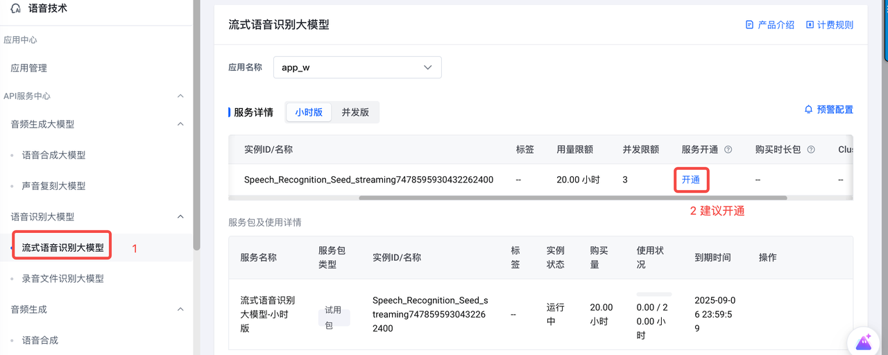
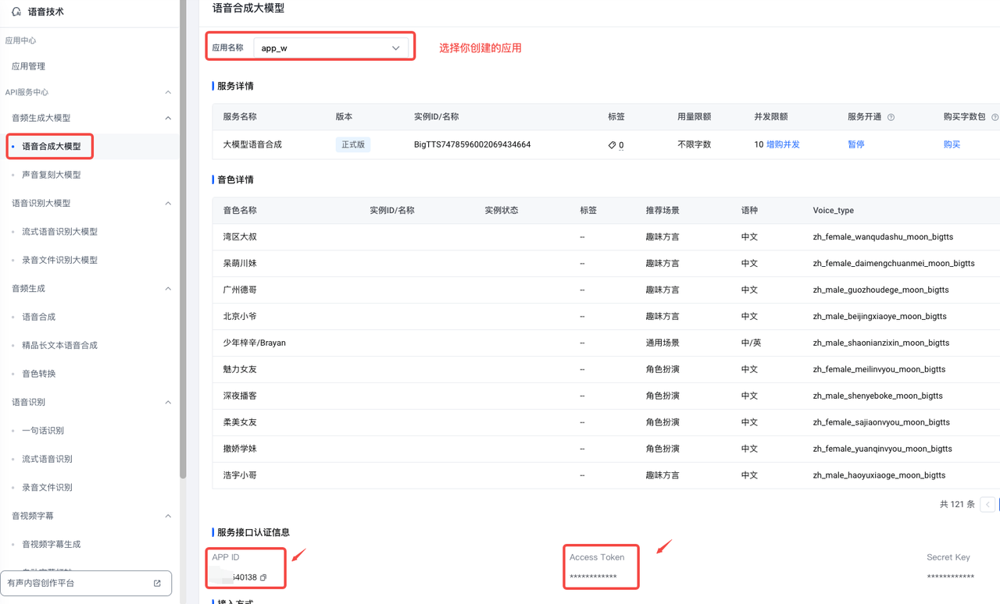

# 视频实时理解 Video Analyser
## 应用介绍

这是一款基于豆包-视觉理解模型实现的具有视频通话功能的应用。它能够对摄像头传输的实时画面进行分析，精准理解画面中的关键信息，包括图表论文、人物表情、动作细节、场景环境等。同时支持高清流畅的视频通话，实现和大模型面对面的即时交流体验。

### 效果预览

[视频地址](https://portal.volccdn.com/obj/volcfe/cloud-universal-doc/upload_b01688a4ee9b3d334ea6b10b94df5e36.mp4)

### 优势

- 实时视频理解：依托豆包大模型的强大能力，实现对视频画面的实时深度理解，迅速抓取关键帧信息，无论是文字、表情、动作还是环境，都能精准洞察，为使用者提供即时、精准的画面解读，增强交互体验。
- 模拟真实互动体验：借助豆包视频大模型的视频实时理解技术，依据画面关键信息，精准模拟真人互动情境，让使用者仿佛正与虚拟角色面对面交流。

### 相关模型

- Doubao-pro-32k：主要参与记忆信息的处理，在当前画面无法直接回答用户问题时，大语言模型将结合历史记忆提供精准答案。
- Doubao-vision-pro-32k：负责对摄像头实时捕捉的视频画面进行视觉内容理解。
- Doubao-语音合成：负责将模型生成的文本回答转化为自然流畅的语音输出。
- Doubao-流式语音识别：将用户的语音提问转写为文本，以便于大模型对用户问题的理解与回复。

### 流程架构


## 环境准备

- Python 版本要求大于等于 3.8，小于 3.12
- [Node.js](https://nodejs.org/) (版本 16.2.0 或更高，推荐 Node.js 18 的 LTS 版本)
- 已获取火山方舟 API Key [参考文档](https://www.volcengine.com/docs/82379/1298459#api-key-%E7%AD%BE%E5%90%8D%E9%89%B4%E6%9D%83)
- 火山语音技术相关准备工作，**仅对企业客户开放，您可以先完成企业实名认证后接入使用**，获取方法参见【附录】
  - 已创建一个**语音服务**的应用 [创建链接](https://console.volcengine.com/speech/app) 
  - 对该应用已开通**语音合成大模型**和**流式语音识别大模型**两个服务 [参照文档](https://www.volcengine.com/docs/6561/163043)
    - 注意：**语音合成大模型**从开通到可以使用有大概5-10分钟延迟
  - 已获取上述两个服务的 APP ID 和 Access Token [参考文档](https://www.volcengine.com/docs/6561/1329505)
- 已创建 Doubao-Vision-Pro 32K 的 endpoint  [参考文档](https://www.volcengine.com/docs/82379/1099522#594199f1)
- 已创建 Doubao-Pro 32K 的endpoint [参考文档](https://www.volcengine.com/docs/82379/1099522#594199f1)

## 快速开始

本文为您介绍如何在本地快速部署 Video Analyser 项目。

1. 下载代码库

   ```bash
    git clone https://github.com/volcengine/ai-app-lab.git
    cd demohouse/video_analyser
   ```
2. 修改配置

   - 修改`backend/code/config.py` 中配置，填入刚刚获取的API keys， endpoint id 和 APP ID和 Access Token 

     | 配置变量名   | 说明                              |
     | ------------ | --------------------------------- |
     | VLM_ENDPOINT | doubao-vision-pro 32k endpoint id |
     | LLM_ENDPOINT | doubao-pro 32k endpoint id        |
     | TTS_APP_ID   | 语音合成模型 APP ID          |
     | TTS_ACCESS_TOKEN      | 语音合成模型 Access Token           |

   - 修改 `frontend/run.sh` 中配置，填入刚刚获取的APP ID和 Access Token


     | 配置变量名       | 说明                          |
     | ---------------- | ----------------------------- |
     | ASR_APP_ID           | 流式语音识别模型  APP ID |
     | ASR_ACCESS_TOKEN | 流式语音识别模型  Access Token  |

   - 修改 `backend/run.sh` 中配置，填入刚刚获取的API key


     | 配置变量名  | 说明             |
     | ----------- | ---------------- |
     | ARK_API_KEY | 火山方舟 API Key |
3. 安装后端依赖

   ```bash
   cd demohouse/video_analyser/backend

   python -m venv .venv
   source .venv/bin/activate
   pip install poetry==1.6.1

   poetry install
   ```
4. 启动后端

   ```bash
   cd demohouse/video_analyser/backend
   bash run.sh
   ```
5. 启动前端

   ```bash
   cd demohouse/video_analyser/frontend
   bash run.sh
   ```

   > **💡 说明**
   > Demo仅仅用于测试，实际生产环境请根据存储类型，实现`backend/code/utils.py` 中 Storage Class 的接口，来实现长期记忆的功能。
   >

## 技术实现

### 前后端交互

前后端的互动仍然是基于一连串的Http `/bot/chat` 请求完成。为了实现实时的视频理解，对每次请求做了一些约定。

1. 前端会发起两种`/bot/chat` 的请求，后端有相应的不同的回复策略：

- 实时抽帧的纯图片：前端每秒会发送一个只包含一帧图片的请求，后端会将其存入长期记忆，用于之后的回答；后端对这个请求不回复任何内容。
- 包含用户提问的请求：当前端通过VAD识别到用户提问时，会将识别出来的问题文字和用户讲话时的当前图片一起发起给后端，后端会以语音形式进行回复。

2. 由于每次`bot/chat` 的请求都是无状态的，前端会在header中传入一个X-Context-Id，帮助后端存储和召回用户的历史视频信息。

### 模型回复策略

实时语音智能体的延时对用户体验影响比较大。我们观察到大部分的提问是基于当前所见信息的提问，如果每次提问都带上长期记忆，会导致无意义的延时增加。因此，我们的策略是当用户提问后，会同时进行两个大模型请求：

- 包含所有长期记忆的请求
- 只包含当前问题和当前图像的请求

一般第二个请求会更快完成，如果模型认为仅基于当前所见即可回答用户问题，则会cancel掉另一个任务，直接返回，优化延迟效果；如果模型认为无法回答，则会等待包含长期记忆的请求完成。


### 长期记忆

实现长期记忆的方式有很多，核心就是将之前视频抽帧的信息压缩到请求模型的 message 中。最简单的方式是将抽帧的图片直接存下，并在收到请求时带上所有历史图片请求 VLM 模型，但是这样弊端很明显，最大 context window 只有 50 张图片，并且过多图片会导致模型的延时过高。
因此，我们采用了一个简单的优化策略：当抽帧图片进来时，我们使用 VLM 对图片信息进行总结，只将总结信息存下，并使用本地内存存储。这样在模型的 context window 中可以放更多的历史信息，并且延时效果更好。

当然，这个策略也有一定的局限性，部分图片里的信息一定会被丢失。更好的长期记忆和召回策略（比如使用向量召回）会在后续的工作中进行探索。

## 附录

### 问题1：如何获取 TTS_APP_ID、TTS_ACCESS_TOKEN、ASR_APP_ID、ASR_ACCESS_TOKEN？

#### 问题背景

不清楚从哪里获取应用实验室互动双语视频生成器 Chat2Cartoon，语音实时通话 - 青青，视频实时理解 Video Analyser中的 TTS_APP_ID、TTS_ACCESS_TOKEN、ASR_APP_ID、ASR_ACCESS_TOKEN变量值。

#### 解决方案

1. 创建应用，同时勾选大模型语音合成和流式语音识别大模型
    

2. 开通语音合成大模型，确保页面具有音色。
   
   

3. 流式语音识别大模型有试用包，可以不开通。如需提供稳定服务，建议开通正式版本。
   

4. 获取TTS_APP_ID 和TTS_ACCESS_TOKEN
   

5. 获取ASR_APP_ID、ASR_ACCESS_TOKEN
   